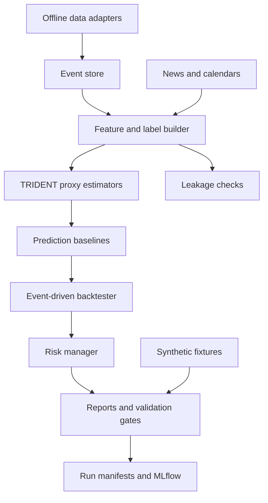

# TRIDENT-LOB Master Plan

Status: Phase 0 synthesis. This plan does not authorize live trading, live broker endpoints, live credentials, paid-data commits, private account data, or profitability claims.

## 1. Recommended Stack

Recommendation: Use Python 3.12 on native arm64 macOS with `uv`, Polars, DuckDB, Parquet, NumPy, SciPy, scikit-learn, Pydantic, OmegaConf, local MLflow, DVC metadata, pytest, Hypothesis, Ruff, mypy, pre-commit, and Typer. Keep XGBoost optional and defer JAX, PyTorch, LightGBM, and deep learning until validation needs justify them. Sources: [architecture decision](../research/12-python-architecture-and-stack/DECISION.md), [reproducibility decision](../research/14-reproducibility-and-experiment-tracking/DECISION.md), https://numpy.org/install/, https://scikit-learn.org/stable/install.html, https://docs.pola.rs/user-guide/concepts/lazy-api/, https://duckdb.org/docs/stable/clients/python/overview, https://mlflow.org/docs/latest/ml/tracking/.

Rationale: Phase 1 must run CPU-only on a Mac M3, use simple baselines first, and keep every component swappable. Sources: [repository rules](../AGENTS.md), [architecture decision](../research/12-python-architecture-and-stack/DECISION.md).

## 2. Final Mathematical Model Summary

TRIDENT-LOB models the visible book as ask and bid liquidity fields `q_plus(p,t)` and `q_minus(p,t)` over tick-space price `p` and time `t`. New limit orders are sources, cancellations are sinks, aggressive market orders are execution sinks, quote revisions create price-space transport, and turbulence proxies `k`, `epsilon`, and `nu_t` describe volatility intensity, dissipation, and liquidity diffusion. Sources: [model spec](../docs/TRIDENT_LOB_MODEL.md), [equation audit](../research/01-equation-audit-and-dimensional-analysis/DECISION.md).

The accepted internal units are ticks, seconds, shares per tick for liquidity, ticks per second for quote velocity, ticks squared per second squared for `k`, ticks squared per second cubed for `epsilon`, and ticks squared per second for diffusivity. Sources: [equation audit](../research/01-equation-audit-and-dimensional-analysis/DECISION.md), https://doc.openfoam.com/2212/tools/processing/models/turbulence/ras/linear-evm/rtm/kEpsilon/.

Phase 1 will not solve the PDE. It will estimate point-in-time proxies for spread, OFI, top-book depth, `k`, `epsilon`, `nu_t`, fragility, market Reynolds number, news forcing, and an L1 latent-interface proxy. Sources: [turbulence decision](../research/02-turbulence-closure-and-fragility/DECISION.md), [price-interface decision](../research/03-latent-order-book-and-price-interface/DECISION.md), [feature decision](../research/08-feature-engineering-and-labels/DECISION.md).

## 3. Literature Support And New Hypotheses

Supported by literature:

- LOB event accounting with add, cancel, execution, spread, and depth states. Sources: [literature decision](../research/00-market-microstructure-literature/DECISION.md), https://doi.org/10.1080/14697688.2013.803148.
- Source-sink and zero-intelligence LOB baselines. Sources: [literature decision](../research/00-market-microstructure-literature/DECISION.md), https://doi.org/10.1287/opre.1090.0780.
- OFI as a short-horizon price-pressure baseline. Sources: [literature decision](../research/00-market-microstructure-literature/DECISION.md), https://arxiv.org/abs/1011.6402.
- Hawkes processes as event-level excitation benchmarks. Sources: [literature decision](../research/00-market-microstructure-literature/DECISION.md), https://arxiv.org/abs/1502.04592.
- Latent order book and square-root impact as impact benchmarks. Sources: [literature decision](../research/00-market-microstructure-literature/DECISION.md), https://arxiv.org/abs/1412.0141, https://doi.org/10.1103/PhysRevX.1.021006.

New TRIDENT hypotheses:

- `k` can be estimated as market turbulence energy from realized tick variance or quote-motion variance.
- `epsilon` can be estimated as dissipation from volatility decay, spread recovery, or depth recovery.
- `k^2 / epsilon` should predict fragility, spread widening, jump risk, and impact amplification after controlling for realized volatility, OFI, spread, and depth.
- Market Reynolds number should separate absorbed imbalance from fragile imbalance regimes.
- News forcing should enter turbulence production only when availability timestamps prove no lookahead.

Sources: [turbulence decision](../research/02-turbulence-closure-and-fragility/DECISION.md), [news decision](../research/07-news-and-exogenous-inputs/DECISION.md), [model spec](../docs/TRIDENT_LOB_MODEL.md).

## 4. Unified Architecture

Sources: [architecture decision](../research/12-python-architecture-and-stack/DECISION.md), [orchestration plan](ORCHESTRATION.md), [backtesting decision](../research/10-backtesting-paper-trading-and-execution/DECISION.md).

## 5. Phase 1 Predictor Scope

Build an offline CPU-only predictor for 1 minute and 5 minute direction, return, spread widening, local jump, depth depletion, and fragility persistence. Use bars, L1 quotes, trades when available, corporate actions, calendars, and optional news. Compare no-skill, last-return sign, logistic regression, ridge regression, lasso diagnostics, random forest, histogram gradient boosting, and optional XGBoost. Sources: [feature decision](../research/08-feature-engineering-and-labels/DECISION.md), [prediction decision](../research/09-prediction-models-and-baselines/DECISION.md), https://scikit-learn.org/stable/modules/generated/sklearn.linear_model.LogisticRegression.html.

## 6. Phase 2 LOB Replay Scope

Use licensed L2 or L3 data to reconstruct visible `q_plus` and `q_minus`, estimate source, cancellation, execution, and depth-recovery terms, and run finite-volume accounting diagnostics. Do not claim full TRIDENT source-sink validation from bars or L1 data. Sources: [numerical decision](../research/04-numerical-discretization/DECISION.md), [calibration decision](../research/05-stochastic-processes-and-calibration/DECISION.md), [data decision](../research/06-data-requirements-and-vendors/DECISION.md), https://lobsterdata.com/info/DataStructure.php, https://databento.com/equities.

## 7. Phase 3 Paper-Trading Scope

Paper trading may begin only after Phase 1 offline validation gates pass. It must use paper-only credentials outside the repo, dry-run first, explicit risk checks, conservative fills, reconciliation reports, and no live endpoint. Alpaca paper is the first candidate only if credentials and data entitlements are available outside Git. Sources: [backtesting decision](../research/10-backtesting-paper-trading-and-execution/DECISION.md), [risk decision](../research/11-risk-controls-and-compliance/DECISION.md), https://docs.alpaca.markets/docs/trading/paper-trading/.

## 8. Data Plan And Buying Recommendation

Free start: Alpaca Free, Massive Basic aggregates/reference, official SEC and macro calendars, and public crypto L2 fixtures for schema and replay tests. Low-cost serious Phase 1: add Alpaca Algo Trader Plus, Massive Advanced, or Databento usage-based TBBO, MBP-1, and trades for fixed windows. Full source/sink validation: use LOBSTER academic access if eligible, otherwise Databento MBO or MBP-10 pilot windows. Sources: [data decision](../research/06-data-requirements-and-vendors/DECISION.md), [DATA_PLAN](DATA_PLAN.md), https://alpaca.markets/data, https://massive.com/pricing?product=stocks, https://databento.com/pricing, https://lobsterdata.com/info/AccessOptions.php.

## 9. Validation Gates Before Live Trading

Live trading is blocked unless future explicit approval follows all gates: leakage-free data, walk-forward out-of-sample performance, transaction-cost-adjusted metrics, paper-trading duration, max drawdown controls, risk controls, broker rule review, credential segregation, manual approval, and staged rollout. Sources: [validation gates](VALIDATION_GATES.md), [risk blockers](../research/11-risk-controls-and-compliance/LIVE_TRADING_BLOCKERS.md), https://ecfr.io/Title-17/Section-240.15c3-5, https://www.finra.org/rules-guidance/rulebooks/finra-rules/2270.

## 10. Risk Register

Primary risks are leakage, overfitting, weak data rights, insufficient L2/L3 evidence, false TRIDENT attribution, backtest execution fantasy, secret leakage, live-trading scope creep, and Mac M3 performance limits. Mitigations are listed in [RISK_REGISTER](RISK_REGISTER.md). Sources: [testing decision](../research/13-testing-validation-and-benchmarks/DECISION.md), [risk decision](../research/11-risk-controls-and-compliance/DECISION.md), [reproducibility decision](../research/14-reproducibility-and-experiment-tracking/DECISION.md).

## 11. Open Questions Requiring User Decision

1. Which `epsilon` proxy should become the Phase 1 default after validation: volatility decay, spread recovery, depth recovery, or filtered latent decay?
2. Which data path should be funded first: free-only, low-cost L1, Databento pilot, or LOBSTER academic if eligible?
3. Should news features be default in Phase 1 or run as a separate ablation until availability timestamps are proven?
4. What paper broker should be considered after internal simulation gates, if any?
5. What risk thresholds should be tightened for paper trading beyond the conservative defaults?

